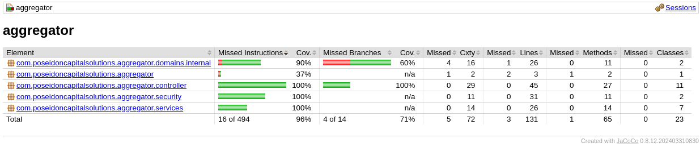
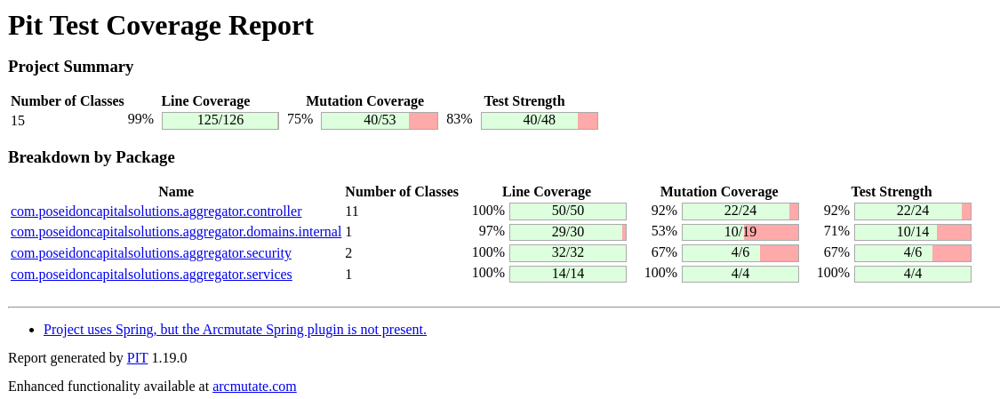

# PoseidonCapitalSolutions

PoseidonCapitalSolutions aggregator makes storing assets safe and secure.

## Table of contents

- [PoseidonCapitalSolutions](#poseidoncapitalsolutions)
  - [Table of contents](#table-of-contents)
  - [Tech stack](#tech-stack)
    - [Database](#database)
    - [Backend](#backend)
    - [Frontend](#frontend)
  - [Running the application](#running-the-application)
    - [Maven](#maven)
    - [Container](#container)
  - [Testing](#testing)
    - [Coverage](#coverage)
    - [Test execution](#test-execution)
    - [Mutation](#mutation)

## Tech stack

### Database

- [MariaDb](https://mariadb.org/): SQL database.
- [SQLx](https://github.com/launchbadge/sqlx): Simple SQL migration.

### Backend

- [Maven](https://maven.apache.org/): Integrated build tool with `mvnw`.
- [Java](https://www.java.com/en/) >=21.
- [Spring boot](https://spring.io/projects/spring-boot): Configure a Spring project.

### Frontend

- [Thymeleaf](https://www.thymeleaf.org/): Java templating engine.
- [Bootstrap](https://getbootstrap.com/): CSS framework.

## Running the application

There are 2 different way to run this application:

### Maven

Run the tests using:

```sh
./mvnw test
```

Run the mutation tests using:

```sh
./mvnw test-compile org.pitest:pitest-maven:mutationCoverage
```

Run the formater using:

```sh
./mvnw spotless:apply
```

Build the application as an uber JAR (a JAR containing all of its dependencies) using:

```sh
./mvnw spring-boot:repackage
java -jar build/**.jar # Run
```

Run the application using:

```sh
cp .env.CHANGEME .env
# Edit the `DATABASE_**` variables to match your PostgreSQL instance
curl --proto '=https' --tlsv1.2 -sSf https://sh.rustup.rs | sh # Install Rust, used to install the migration tool
cargo install sqlx-cli
sqlx database setup
./mvnw spring-boot:run
```

### Container

You can run the application using an [OCI compliant container engine](https://en.wikipedia.org/wiki/Open_Container_Initiative) (like [Docker](https://www.docker.com/) or [Podman](https://podman.io/)) that supports the [compose specification](https://compose-spec.io/).

```sh
# Using Docker
docker-compose up -d
# Using Podman
podman-compose up -d
```

## Testing

This application was tested on a Linux machine (Ubuntu 24.10 x86_64).

### Coverage



### Mutation


